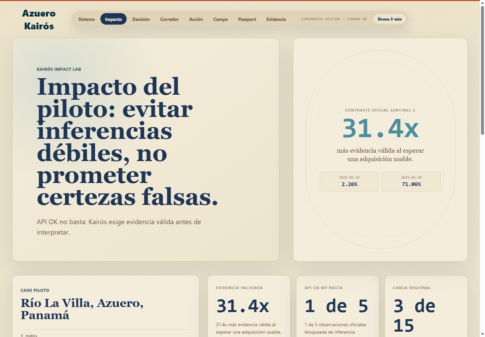
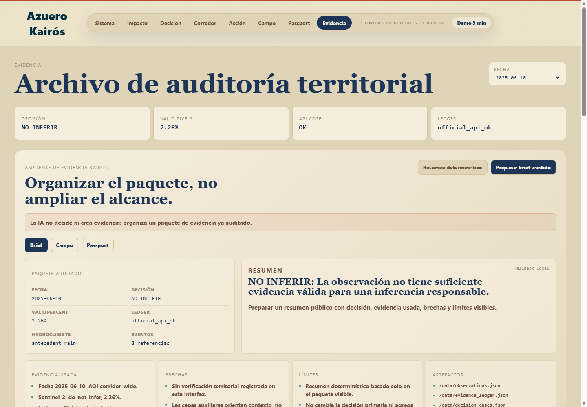

# Azuero Kairós

Sistema de confianza para evidencia territorial basada en Copernicus.

Azuero Kairós convierte observaciones Sentinel-2 en decisiones responsables,
trazables y compartibles. Su promesa no es detectar lo invisible: su promesa es
evitar inferir cuando la evidencia satelital no alcanza.

## Resumen para la hackathon

El piloto trabaja sobre el corredor del río La Villa, Azuero, Panamá. A partir
de datos Copernicus, el sistema responde una pregunta concreta:

> ¿Esta observación satelital tiene evidencia válida suficiente para usarse con
> cautela, debe revisarse, o no debe usarse para inferir?

La salida principal no es una alerta ambiental, ni una certificación de campo.
Es una decisión de confianza de observación:

- `USABLE`: la escena tiene evidencia válida suficiente para lectura
  exploratoria con límites explícitos.
- `REVISAR`: la escena tiene señal parcial o requiere cautela adicional.
- `NO INFERIR`: la escena no sostiene una inferencia responsable.

## Por qué importa

Muchos productos de satélite muestran mapas y métricas aunque la escena sea
débil. Kairós hace lo contrario: bloquea inferencias cuando la evidencia es
insuficiente y documenta por qué.

El caso clave del demo es el contraste:

| Fecha | AOI | validPercent | Decisión |
| --- | --- | ---: | --- |
| 2025-06-10 | `corridor_wide` | 2.26% | `NO INFERIR` |
| 2025-06-30 | `corridor_wide` | 71.06% | `USABLE` |

Esperar una adquisición usable produce un aumento de evidencia válida de
aproximadamente `31.4x`. Esa es la tesis del producto: una buena decisión puede
ser esperar, revisar o documentar límites.

## Qué incluye la entrega

- Frontend público en React/Vite con navegación por módulos.
- Sistema/Ciclo Kairós: del satélite a la auditoría.
- Impacto: contraste de evidencia entre escenas débiles y usables.
- Decisión: sello `USABLE`, `REVISAR` o `NO INFERIR`.
- Corredor: matriz de nodos del río La Villa y capas auxiliares.
- Acción: cola de casos para revisión responsable.
- Campo: verificación lite sin claims nuevos.
- Passport: artefacto portable verificable en `/trust/v1`.
- Evidencia: ledger, paquete auditado y asistente con fallback determinístico.
- Trust Layer v1: JSON estático público con decisiones, passports, ledger,
  hashes y reporte de validación.

## Screenshots

A desktop walkthrough of the public Azuero Kairós demo. The sequence moves from
the evidence cycle to a deterministic decision, then to auditability and the
read-only Trust Layer. These views illustrate the reproducible public export;
they are not a live operational dashboard.

### Azuero Kairós: Responsible Evidence Cycle


### Sentinel-2 Evidence Contrast: 2.26% vs. 71.06% Valid Coverage



### Deterministic Decision Gate: NO INFERIR


### Territorial Evidence Archive: Decisions, Limits, and Ledger Traceability



### Kairós Trust Passport: Portable Evidence and Hash-Based Provenance


## Flujo del demo en 3 minutos

La interfaz incluye el control `Demo 3 min`, que guía el pitch:

1. Sistema: ciclo completo de evidencia.
2. Impacto: `31.4x` de evidencia al esperar.
3. Decisión: `2025-06-10`, `NO INFERIR`.
4. Contraste: `2025-06-30`, `USABLE`.
5. Corredor: tres nodos y capas auxiliares.
6. Acción: cola de revisión.
7. Campo: verificación lite.
8. Passport: artefacto Trust.
9. Evidencia: ledger y asistente.

## Datos oficiales del piloto

Resultados Sentinel-2 oficiales para `corridor_wide`:

| Fecha | validPercent | Clase |
| --- | ---: | --- |
| 2025-06-02 | 49.15% | `USABLE` |
| 2025-06-10 | 2.26% | `NO INFERIR` |
| 2025-06-15 | 44.22% | `USABLE` |
| 2025-06-30 | 71.06% | `USABLE` |
| 2025-07-15 | 52.22% | `USABLE` |

La data pública está sanitizada. Los JSON servidos por el frontend no exponen
rutas internas a artefactos crudos, CSV procesados ni archivos privados. Las
referencias públicas usan `/data/...` y `/trust/v1/...`.

## Cómo correr el frontend

Desde la raíz del repositorio:

```powershell
cd frontend
npm install
npm.cmd run dev
```

Para generar build de producción:

```powershell
cd frontend
npm.cmd run build
```

La app consume JSON estáticos desde:

```text
frontend/public/data
frontend/public/trust/v1
```

No se necesitan llamadas externas para correr el demo público.

## Validación de entrega

Comandos recomendados antes de presentar:

```powershell
cd frontend
npm.cmd run build
cd ..
python scripts/validate_public_demo.py
```

El validador revisa:

- observaciones oficiales esperadas;
- contraste `2025-06-10` vs `2025-06-30`;
- uplift de evidencia;
- cobertura de Corredor, SAR, CLMS e HydroClimate;
- hashes de ledger y Passport;
- ausencia de rutas internas, secretos, headers o payloads crudos en público;
- ausencia de mojibake en artefactos generados;
- ausencia de claims positivos prohibidos.

Estado actual de calidad: `12/12` checks, `0` warnings, `0` failures.

## Claim-firewall oficial

El claim-firewall oficial vive en `scripts/validate_public_demo.py`. No es un
grep suelto sobre todo el repositorio: es una validación enfocada en la
superficie pública de entrega.

Comando oficial:

```powershell
python scripts/validate_public_demo.py
```

Qué protege:

- `/data` y `/trust/v1` no deben exponer secretos, headers, rutas locales ni
  payloads crudos.
- Trust Layer no debe contener claims positivos de contaminación, detección
  química, validación sanitaria, potabilidad, seguridad del agua, crisis,
  cierre automático, preparación operativa, decisión de autoridad, rendimiento
  o pérdida medida.
- Las frases de límite son válidas cuando niegan explícitamente esos alcances,
  por ejemplo: "no certifica condiciones químicas, sanitarias ni operativas".

Regla de oro: Kairós verifica trazabilidad y confianza de observación; no
certifica condiciones del territorio.

## Trust Layer v1

La capa Trust es estática y read-only. Permite verificar un Passport sin base de
datos ni API externa.

Rutas principales:

```text
/trust/v1/index.json
/trust/v1/passports/<passport_id>.json
/trust/v1/decisions/<decision_id>.json
/trust/v1/ledger/<event_id>.json
/trust/v1/validation_report.json
/trust/v1/openapi.json
```

El Passport verifica trazabilidad del paquete de evidencia: fecha, AOI o nodo,
clase de confianza, porcentaje válido, estado API, capa primaria, capas
auxiliares, ledger, hash y límites.

No certifica territorio, agua, contaminación, condiciones químicas, condiciones
sanitarias ni preparación operativa.

## Pipeline técnico

El pipeline interno puede correr con credenciales de Copernicus Data Space
Ecosystem por variables de entorno:

```powershell
$env:CDSE_CLIENT_ID = "your-client-id"
$env:CDSE_CLIENT_SECRET = "your-client-secret"
```

Comandos principales:

```powershell
python scripts/run_official_s2_batch.py
python scripts/build_evidence_ledger.py
python scripts/export_public_data.py
python scripts/export_public_watch_data.py
python scripts/export_public_decision_cases.py
python scripts/export_trust_layer.py
python scripts/validate_public_demo.py
```

Los artefactos internos pueden existir bajo `outputs/`, pero la entrega pública
usa exportaciones sanitizadas en `frontend/public`.

## Límites científicos

Azuero Kairós no detecta pesticidas, atrazina, patógenos, metales pesados,
contaminación química disuelta ni potabilidad. No declara si el agua es segura
para consumo, riego, animales o contacto humano.

No valida crisis, no ordena cierres, no reemplaza laboratorio, no reemplaza
autoridad competente y no toma decisiones de pago, crédito, seguro o sanción.

La salida es una evaluación de confianza de observación satelital Sentinel-2,
con contexto auxiliar que nunca modifica la clasificación primaria.

## Declaración de build limpio

Este repositorio contiene la entrega oficial de hackathon de Azuero Kairós. El
trabajo previo fue planificación y exploración descartada. El código, los
artefactos oficiales, la interfaz pública, el ledger, Trust Layer y Passport se
preparan desde este repositorio para revisión reproducible.
