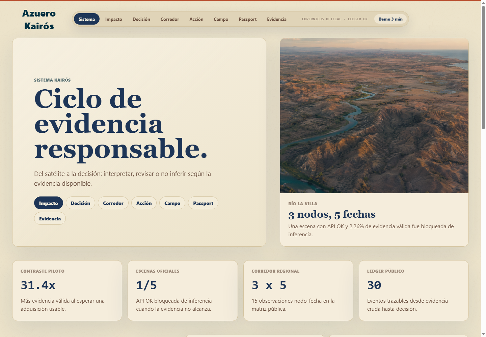
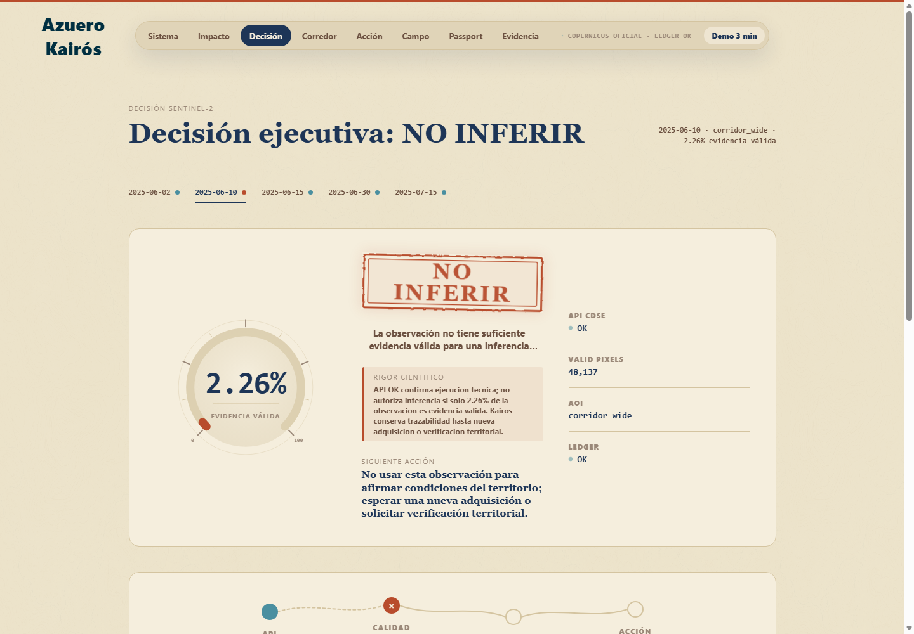
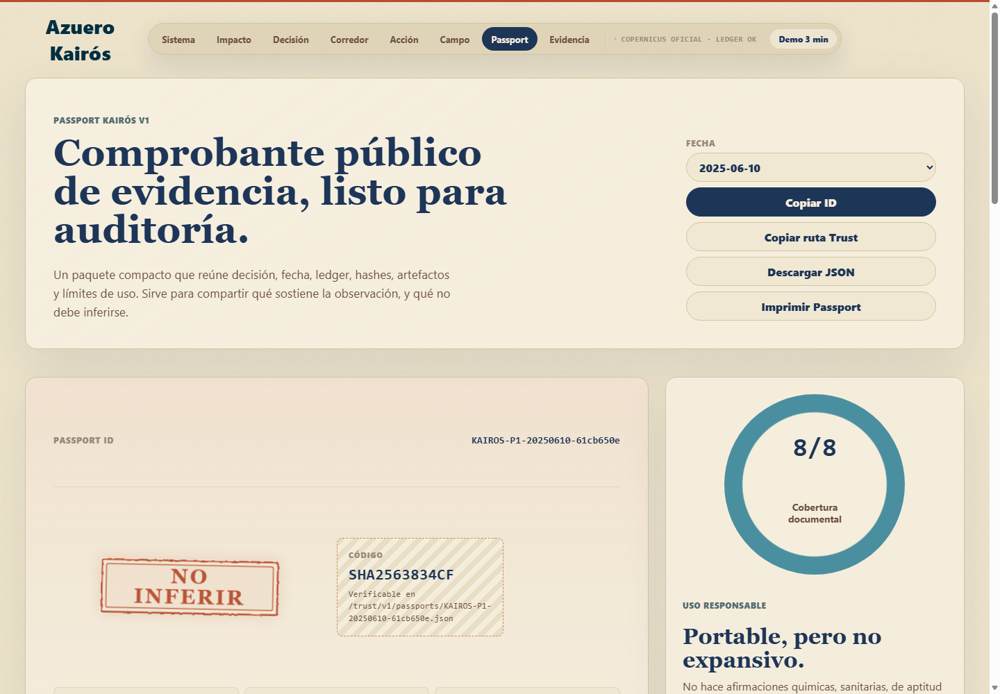

# Azuero Kairós

A Copernicus-based trust system for territorial evidence.

Azuero Kairós turns Sentinel-2 observations into responsible, traceable, and
shareable decisions. Its promise is not to detect the invisible. Its promise is
to avoid inference when the available satellite evidence is not strong enough.

## Hackathon Summary

The pilot focuses on the Río La Villa corridor in Azuero, Panama. Using
Copernicus data, the system answers one concrete question:

> Does this satellite observation contain enough valid evidence to be used with
> caution, require review, or remain unsuitable for inference?

The primary output is not an environmental alert or a field certification. It
is an observation-confidence decision:

- `USABLE`: the scene has enough valid evidence for exploratory reading with
  explicit limits.
- `REVISAR`: the scene contains partial evidence or requires additional
  caution.
- `NO INFERIR`: the scene does not support a responsible inference.

## Why It Matters

Many satellite products display maps and metrics even when the scene is weak.
Kairós does the opposite: it blocks inference when evidence is insufficient and
documents why.

The key demo case is the contrast:

| Date | AOI | validPercent | Decision |
| --- | --- | ---: | --- |
| 2025-06-10 | `corridor_wide` | 2.26% | `NO INFERIR` |
| 2025-06-30 | `corridor_wide` | 71.06% | `USABLE` |

Waiting for a usable acquisition produces approximately `31.4x` more valid
evidence. That is the product thesis: a responsible decision may be to wait,
review, or document limits.

## What Is Included

- Public React/Vite frontend with module-based navigation.
- Kairós System/Cycle: from satellite observation to audit.
- Evidence Contrast: comparison between weak and usable scenes.
- Decision: `USABLE`, `REVISAR`, or `NO INFERIR` status.
- Corridor: Río La Villa node matrix and auxiliary layers.
- Action: case queue for responsible review.
- Field: lightweight verification preparation with no new claims.
- Passport: portable artifact verifiable through `/trust/v1`.
- Evidence: ledger, audited package, and assistant with deterministic fallback.
- Trust Layer v1: public static JSON with decisions, Passports, ledger events,
  hashes, and a validation report.

## Screenshots

A desktop walkthrough of the public Azuero Kairós demo. The sequence moves from
the evidence cycle to a deterministic decision, then to auditability and the
read-only Trust Layer. These views illustrate the reproducible public export;
they are not a live operational dashboard.

### Azuero Kairós: Responsible Evidence Cycle



### Sentinel-2 Evidence Contrast: 2.26% vs. 71.06% Valid Coverage


### Deterministic Decision Gate: NO INFERIR



### Territorial Evidence Archive: Decisions, Limits, and Ledger Traceability


### Kairós Trust Passport: Portable Evidence and Hash-Based Provenance



## Documentation

- [Architecture](docs/architecture.md): the implemented Copernicus-to-ledger
  pipeline.
- [Decision Rules](docs/decision_rules.md): deterministic classification and
  auxiliary-layer guardrails.
- [Scientific Limits](docs/scientific_limits.md): the claims the system does
  not make.
- [Demo Quality Report](docs/demo_quality_report.md): the checked-in public-export
  validation summary.

## 3-Minute Demo Flow

The interface includes a `Demo 3 min` control that guides the pitch:

1. System: complete evidence cycle.
2. Evidence Contrast: `31.4x` more valid evidence when waiting.
3. Decision: `2025-06-10`, `NO INFERIR`.
4. Contrast: `2025-06-30`, `USABLE`.
5. Corridor: three nodes and auxiliary layers.
6. Action: review queue.
7. Field: lightweight verification preparation.
8. Passport: Trust artifact.
9. Evidence: ledger and assistant.

## Official Pilot Data

Official Sentinel-2 results for `corridor_wide`:

| Date | validPercent | Class |
| --- | ---: | --- |
| 2025-06-02 | 49.15% | `USABLE` |
| 2025-06-10 | 2.26% | `NO INFERIR` |
| 2025-06-15 | 44.22% | `USABLE` |
| 2025-06-30 | 71.06% | `USABLE` |
| 2025-07-15 | 52.22% | `USABLE` |

The public data is sanitized. JSON served by the frontend does not expose
internal paths to raw artifacts, processed CSV files, or private files. Public
references use `/data/...` and `/trust/v1/...`.

## Running the Frontend

From the repository root:

```powershell
cd frontend
npm install
npm.cmd run dev
```

To create a production build:

```powershell
cd frontend
npm.cmd run build
```

The app consumes static JSON from:

```text
frontend/public/data
frontend/public/trust/v1
```

No external calls are required to run the public demo.

## Delivery Validation

Recommended commands before presenting:

```powershell
cd frontend
npm.cmd run build
cd ..
python scripts/validate_public_demo.py
```

The validator checks:

- expected official observations;
- the `2025-06-10` vs. `2025-06-30` contrast;
- evidence uplift;
- Corridor, SAR, CLMS, and HydroClimate coverage;
- ledger and Passport hashes;
- absence of internal paths, secrets, headers, or raw payloads in public data;
- absence of mojibake in generated artifacts;
- absence of prohibited positive claims.

Current quality status: `12/12` checks, `0` warnings, `0` failures.

## Official Claim Firewall

The official claim firewall lives in `scripts/validate_public_demo.py`. It is
not a loose grep across the whole repository. It is a focused validation of the
public delivery surface.

Official command:

```powershell
python scripts/validate_public_demo.py
```

It protects the following boundaries:

- `/data` and `/trust/v1` must not expose secrets, headers, local paths, or
  raw payloads.
- The Trust Layer must not contain positive claims about contamination,
  chemical detection, sanitary validation, potability, water safety, crisis
  status, automatic closure, operational readiness, authority decisions,
  measured performance, or measured loss.
- Limitation statements are valid when they explicitly deny those scopes, for
  example: "does not certify chemical, sanitary, or operational conditions."

The rule is simple: Kairós verifies observation confidence and traceability. It
does not certify territorial conditions.

## Trust Layer v1

The Trust Layer is static and read-only. It allows a Passport to be verified
without a database or external API.

Primary routes:

```text
/trust/v1/index.json
/trust/v1/passports/<passport_id>.json
/trust/v1/decisions/<decision_id>.json
/trust/v1/ledger/<event_id>.json
/trust/v1/validation_report.json
/trust/v1/openapi.json
```

The Passport verifies traceability for the evidence package: date, AOI or node,
confidence class, valid percentage, API status, primary layer, auxiliary
layers, ledger, hash, and usage limits.

It does not certify territory, water, contamination, chemical conditions,
sanitary conditions, or operational readiness.

## Technical Pipeline

The internal pipeline can run with Copernicus Data Space Ecosystem credentials
provided through environment variables:

```powershell
$env:CDSE_CLIENT_ID = "your-client-id"
$env:CDSE_CLIENT_SECRET = "your-client-secret"
```

Main commands:

```powershell
python scripts/run_official_s2_batch.py
python scripts/build_evidence_ledger.py
python scripts/export_public_data.py
python scripts/export_public_watch_data.py
python scripts/export_public_decision_cases.py
python scripts/export_trust_layer.py
python scripts/validate_public_demo.py
```

Internal artifacts may exist under `outputs/`, but the public delivery uses
sanitized exports under `frontend/public`.

## Scientific Limits

Azuero Kairós does not detect pesticides, atrazine, pathogens, heavy metals,
dissolved chemical contamination, or potability. It does not determine whether
water is safe for consumption, irrigation, animals, or human contact.

It does not validate crises, order closures, replace laboratory testing,
replace a competent authority, or make payment, credit, insurance, or sanction
decisions.

The output is a Sentinel-2 satellite-observation confidence assessment,
supported by auxiliary context that never changes the primary classification.

## Repository Scope

This repository contains the reproducible Azuero Kairós hackathon delivery. The
shipped code, official artifact snapshot, public interface, ledger, Trust Layer,
and Passports are prepared from this repository for technical review.
